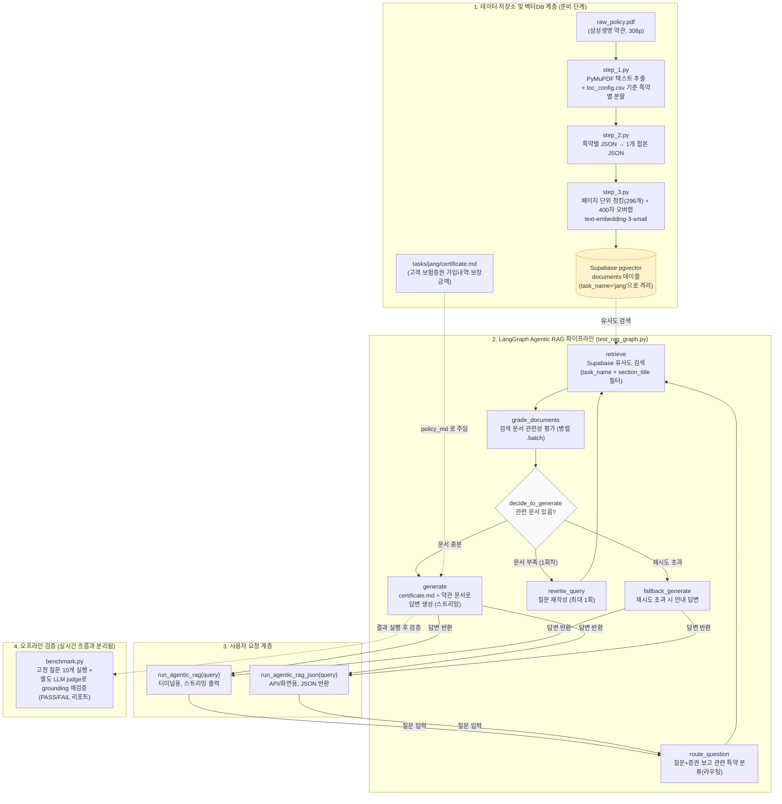

# 프로젝트 정리 노트 (modify.md)

이 문서는 두 가지를 담고 있습니다.
1. **이 프로젝트가 지금 어떤 파일들로 이루어져 있고, 각 파일이 뭘 하는지** 
2. **오늘(2026-08-05) 무엇을 왜 고쳤는지** — 발견한 문제 → 원인 → 조치 순서로 정리

---

## 1. 이 프로젝트는 뭘 하는 프로그램인가

한 문장으로: **보험약관 PDF(수백 페이지)를 읽어서, AI가 "내 보험에서 이런 경우 얼마 받을 수 있어?" 같은 질문에 정확한 근거(조항·페이지)를 대며 답변하게 만드는 프로그램**입니다.

크게 두 단계로 나뉩니다.
- **[준비 단계]** 사람 한 명당 약관 PDF + 보험증권을 넣으면, AI가 "검색해서 찾아 읽을 수 있는" 형태(벡터DB)로 미리 변환해둡니다. (아래 2번 `step_1~3.py`)
- **[질문 단계]** 사용자가 질문을 하면, 미리 만들어둔 벡터DB에서 관련 조항을 찾아와 AI가 답변을 만듭니다. (아래 2번 `test_rag_graph.py`)

---

## 2. 파일별 역할 (전체 지도)

### 준비 단계 — 약관 PDF를 벡터DB로 만드는 3단계 파이프라인
| 파일 | 역할 (쉬운 설명) |
|---|---|
| [main.py](main.py) | 메뉴를 띄워서 "누구 데이터를 어떤 단계까지 처리할지" 골라 실행하는 프로그램의 정문(입구). |
| [step_1.py](step_1.py) | **1단계.** 원본 PDF를 열어서, 목차표(`toc_config.csv`)에 적힌 특약별 페이지 범위대로 텍스트를 잘라냅니다. 결과물은 특약마다 하나씩 JSON 파일로 저장됩니다. |
| [step_2.py](step_2.py) | **2단계.** 1단계에서 나온 특약별 JSON 여러 개를 사람 한 명 기준 파일 하나로 합칩니다. |
| [step_3.py](step_3.py) | **3단계.** 합쳐진 텍스트를 페이지 단위로 잘라(청킹) OpenAI로 숫자 벡터로 변환(임베딩)한 뒤, Supabase(클라우드 DB)에 저장합니다. 이후 검색은 이 벡터를 대상으로 이뤄집니다. |
| [rag_common.py](rag_common.py) | 여러 파일이 공통으로 쓰는 부품 모음. "이 사람 증권 요약 불러오기", "Supabase 벡터DB에 연결하기" 같은 반복 코드를 한 곳에 모아둔 것. |
| [rebuild_db.py](rebuild_db.py) | 장석찬 씨 한 명만 1~3단계를 한 번에 다시 돌리는 개발용 단축 스크립트. |
| [db/schema.sql](db/schema.sql) | Supabase(클라우드 DB)에 딱 한 번 실행해서 "벡터를 저장할 테이블"과 "유사도 검색 함수"를 만들어두는 설정 파일. |
| [requirements.txt](requirements.txt) | 이 프로그램을 돌리는 데 필요한 파이썬 부품(라이브러리) 목록. `pip install -r requirements.txt`로 한 번에 설치. |

### 질문 단계 — 실제로 질문에 답하는 엔진
| 파일 | 역할 (쉬운 설명) |
|---|---|
| [test_rag_graph.py](test_rag_graph.py) | 이 프로젝트의 유일한 질의응답 엔진. "이 질문은 어떤 특약이랑 관련 있지?"부터 자동으로 판단하고, 검색 결과가 부실하면 질문을 스스로 바꿔서 재검색까지 하는 다단계(LangGraph) AI. 용도별로 함수가 두 개 있습니다: `run_agentic_rag(query)`는 터미널에 사람이 읽기 좋게 출력하고, `run_agentic_rag_json(query)`는 웹/앱 화면이나 API에 바로 꽂을 수 있는 JSON 문자열을 반환합니다. |
| [benchmark.py](benchmark.py) | 미리 정해둔 검증 질문들을 실제로 돌려보고, 답변이 근거 문서에 진짜 기반했는지(hallucination 없는지) LLM으로 이중 검증해서 PASS/FAIL 리포트를 만드는 회귀 테스트 스크립트. |

### 사람별 데이터 (`tasks/{이름}/`, `pdf_policy/`, `pdf_certificate/`)
| 위치 | 역할 |
|---|---|
| `pdf_policy/`, `pdf_certificate/` | 사람들 원본 PDF(약관/증권)를 모아두는 창고. 여기서 `tasks/{이름}/inputs/`로 복사해 넣고 파이프라인을 돌립니다. |
| `tasks/{이름}/inputs/` | 그 사람의 원본 약관 PDF + 목차표(CSV). 파이프라인의 "재료". |
| `tasks/{이름}/parsed_json_parts/` | step_1 결과물 (특약별 JSON). |
| `tasks/{이름}/final_output/` | step_2 결과물 (한 명 기준 합본 JSON). |
| `tasks/{이름}/certificate.md` | 그 사람 **보험증권**(가입금액·보장금액 표)을 사람이 markdown으로 정리해둔 파일. 벡터DB를 안 거치고 질문할 때마다 통째로 AI 프롬프트에 들어갑니다 (분량이 적어서 검색보다 이 방식이 더 정확함). |
| `tasks/{이름}/enrolled_sections.json` | 그 사람이 **실제로 가입한 특약명 allowlist**. 원본 약관 PDF는 상품 전체(예: 32개 특약)를 담고 있어서, 이 목록으로 걸러주지 않으면 안 가입한 특약까지 답변 근거로 섞여 들어갑니다. |

---

## 3. 시스템 아키텍처 다이어그램



- **점선(`-.->`)**: 벡터 검색이 아닌 방식으로 데이터가 흘러가는 경로 (예: `certificate.md`는 임베딩 안 되고 프롬프트에 그대로 주입, `benchmark.py`는 실시간 응답 흐름이 아니라 별도로 실행하는 오프라인 검증)
- **`grade_documents` → `generate`/`rewrite_query`/`fallback_generate`**: 관련 문서가 있으면 바로 답변, 부족하면 질문을 스스로 바꿔서 1회 재검색, 그래도 없으면 안내 문구로 종료

---

## 4. 오늘 발견하고 고친 문제들

### 🔴 문제 1: 약관 본문이 사실상 통째로 사라지고 있었음 (가장 심각)
- **증상**: 장석찬님 약관 296페이지를 확인해보니, 실제 조항 내용은 하나도 없고 페이지 번호(`- 231 -` 같은)만 저장되어 있었습니다. 즉 지금까지 만든 벡터DB는 "빈 껍데기"에 가까웠습니다.
- **원인**: PDF에서 글자를 뽑아오는 코드([step_1.py](step_1.py))가, 한 페이지 안의 여러 문단(블록) 중 **딱 첫 번째 블록만 남기고 나머지를 전부 버리는 실수**가 있었습니다. 그런데 각 페이지의 "첫 번째 블록"은 대부분 본문이 아니라 페이지 하단의 쪽번호였습니다.
- **조치**: 해당 필터링 로직을 고쳐서 모든 문단이 살아남도록 수정했습니다. 추가로, 이 문서가 실제로는 2단(신문처럼 좌우로 나뉜) 레이아웃이 아니라는 것도 확인해서, 문단을 위에서 아래로 자연스러운 순서로 합치도록 개선했습니다.
- **결과**: 296페이지 전부 실제 조항 텍스트가 정상적으로 들어가는 것을 확인했습니다.

### 🔴 문제 2: 마지막 특약(부록)의 페이지 정보가 틀려있었음
- **증상**: 맨 마지막 특약(부록·인용법령)의 "이 특약은 총 몇 페이지"라는 정보가 24페이지라고 되어 있었는데 실제로는 12페이지였습니다.
- **원인**: PDF 파일 전체 페이지 수(308)를 그대로 "약관에 인쇄된 마지막 페이지 번호"로 착각해서 계산했습니다. 실제로는 앞쪽 12페이지(표지·안내문)가 별도로 있어서 인쇄된 페이지 번호는 296까지만 존재합니다.
- **조치**: 이 계산에도 앞서 나온 오프셋(12)을 반영하도록 수정했습니다. (다행히 실제 텍스트 손실은 없었고, "메타데이터 숫자"만 틀려있던 문제였습니다.)

### 🟡 문제 3: 벡터DB에 옛날 데이터와 최신 데이터가 뒤섞여 쌓이고 있었음
- **증상**: 벡터DB(당시 로컬 Chroma) 안에 페이지당 1개씩 있어야 할 데이터가 2배(604개)로 들어있었고, 그중 절반은 문제 1의 "빈 껍데기" 데이터, 나머지 절반은 그보다 더 예전 버전이었습니다. 심지어 페이지 번호 표기 방식도 두 버전이 서로 달라 출처 정보가 뒤죽박죽이었습니다.
- **원인**: 벡터DB를 다시 만들 때 기존 데이터를 지우지 않고 계속 추가만 하는 구조였습니다.
- **조치**: 다시 만들 때는 항상 그 사람의 기존 데이터를 먼저 지우고 새로 넣도록 수정했습니다 (지금은 Supabase 기준으로 적용됨).

### 🟢 문제 4(선제 조치): 배포 전에 정리해둔 것들
- **보험증권 요약 파일 이름/위치 정리**: `Jang.md`(대문자 J, 프로젝트 루트)로 되어 있던 걸 `tasks/jang/certificate.md`로 옮겼습니다. Windows에서는 문제없이 동작했지만, 나중에 Vercel(Linux 서버) 배포 시 대소문자를 구분하는 파일시스템에서 조용히 파일을 못 찾는 사고를 미리 막기 위함입니다.
- **특정 인물 하드코딩 제거**: 코드 곳곳에 "jang"이 고정값으로 박혀있던 걸, 어떤 사람이든 `task_name`만 바꾸면 되도록 함수들을 일반화했습니다 → 더미 유저 추가가 "파일 하나 넣기" 수준으로 쉬워집니다.
- **벡터DB를 로컬(Chroma) → 클라우드(Supabase pgvector)로 이전**: Vercel처럼 서버리스 환경은 로컬 디스크에 파일을 영구 저장할 수 없어서, 지금까지 쓰던 로컬 벡터DB 방식은 배포하면 바로 망가집니다. 그래서 Supabase(클라우드 Postgres + pgvector)로 옮기고, 한 테이블에 여러 사람 데이터를 같이 저장하되 `task_name`으로 서로 안 섞이게 분리하는 구조로 바꿨습니다.

---

## 5. RAG 방식을 3개 → 1개로 정리
원래 `test_rag.py`(단순 텍스트 답변) / `test_search.py`(단순 JSON 답변) / `test_rag_graph.py`(LangGraph 고급 버전) 세 개가 있었는데, 벤치마크로 [test_rag_graph.py](test_rag_graph.py)의 정확도를 확인한 뒤 이걸로 최종 결정했습니다.
- `test_rag.py`는 `test_rag_graph.py`가 기능을 완전히 포함하는 상위호환이라 그냥 삭제.
- `test_search.py`는 삭제하기 전에, 걔가 갖고 있던 **JSON 응답 형태**만 `test_rag_graph.py`에 `run_agentic_rag_json()` 함수로 옮겨 담고 나서 삭제했습니다. (터미널 확인용 `run_agentic_rag()`은 그대로 유지)

## 6. LangGraph는 어디서, 어떻게 쓰였나

이 프로젝트의 유일한 RAG 엔진인 [test_rag_graph.py](test_rag_graph.py) 전체가 LangGraph로 만들어져 있습니다. (전에는 단순 버전 2개와 비교하는 맥락이었는데, 지금은 이거 하나만 남았습니다.)

### 왜 필요했나
단순 RAG는 "질문 그대로 벡터DB에 검색 → 나온 거 그대로 LLM에 넘김" 한 방향으로만 흐릅니다. 문제는:
- 검색이 엉뚱한 특약에서 결과를 가져올 수 있고
- 검색 결과가 질문과 관련 없을 수도 있고
- 그래도 그냥 그걸로 답변을 만들어버립니다

LangGraph는 이 흐름을 **"판단하면서 되돌아갈 수 있는" 상태 기계(그래프)**로 만들어서 이 문제를 보완합니다.

### 실제 흐름 (`test_rag_graph.py` 안의 노드들)
```
route_question → retrieve → grade_documents ─┬─(문서 충분&관련있음)→ generate → 끝
                     ↑                        ├─(관련 문서 없음, 재시도 가능)→ rewrite_query ─┘
                     └───────────────────────┘
                                              └─(재시도 다 했는데도 없음)→ fallback_generate → 끝
```

1. **`route_question`** — 질문("식중독으로 5일 입원하면 얼마 받아?")과 보험증권을 LLM에 보여주고 "이건 기초응급자금특약·재해치료비보장특약 관련이네"처럼 **관련 특약 이름을 먼저 골라내게** 합니다. (전체 300페이지 다 뒤지지 말고 관련 있는 데만 좁혀서 찾자는 의도)
2. **`retrieve`** — 위에서 고른 특약으로 좁혀서 Supabase 벡터DB 검색 (`rag_common.py`의 `get_vectorstore()` 사용)
3. **`grade_documents`** — 검색된 문서 하나하나를 LLM한테 "이거 질문이랑 관련 있어?"라고 다시 물어봐서 관련 없는 건 걸러냅니다
4. **조건 분기(`decide_to_generate`)** — 걸러내고 남은 게 있으면 → `generate`(답변 작성)로, 하나도 없으면 → `rewrite_query`(질문을 검색하기 좋은 형태로 스스로 바꿔서) → 다시 `retrieve`로 되돌아감 (최대 1회 재시도), 그래도 없으면 → `fallback_generate`("못 찾았습니다" 안내)
5. **`generate`** — 걸러진 문서 + 보험증권을 합쳐서, %로 되어있는 지급 기준을 실제 원화 금액으로 계산까지 해서 최종 답변 작성

이 노드/분기 구조 자체를 파일 맨 아래(`workflow = StateGraph(...)` 부분, [test_rag_graph.py:338-372](test_rag_graph.py#L338-L372))에서 그래프로 조립하고 `app.compile()`로 실행 가능한 형태로 만듭니다. 나머지 두 스크립트보다 LLM 호출이 여러 번(라우팅 1회 + 문서 평가 N회 + 필요시 재작성 1회 + 최종답변 1회) 일어나는 대신, 엉뚱한 근거로 답변하는 걸 줄이는 게 목적입니다.

## 7. 벤치마크/실사용 테스트로 찾은 문제들

[benchmark.py](benchmark.py)로 장석찬님 약관 기준 정답을 미리 아는 검증 질문 10개를 돌려서, 답변이 실제로 근거 문서/증권에 기반했는지(hallucination 없는지) LLM으로 이중 검증했습니다.

- **찾은 오류 ① → 재조사 결과 오류 아니었음 (정정)**: "갑상선암 진단 시 보장금액?" 질문에 AI가 "가입금액의 30%(600만원)"이라고 답했는데, 처음엔 이걸 오류로 잘못 보고했습니다. 실제 약관 원문(86페이지, 별표1)을 다시 확인해보니 "일반(초기가 아닌) 갑상선암=30%, 초기갑상선암=10%, 초기 이후 다른 갑상선암=20%"인 **3단계 구조**였고, AI는 질문이 특정하지 않은 일반 케이스(30%)로 정확히 답한 것이었습니다. 벤치마크의 LLM 판정관이 "초기갑상선암"이라는 예외 케이스를 일반 케이스로 착각해서 잘못 FAIL 판정한 것이었고, 저도 그걸 그대로 믿고 오류로 보고했었습니다.
- **찾은 오류 ② (수정 완료)**: "암 치료 10일 입원 시 입원비?" 질문에 AI가 장석찬님이 가입하지도 않은 "암치료비특약"을 있다고 착각해서, 실제 가입한 특약 보험금에 중복으로 더해 **2배로 부풀려 답변**함.
  - **원인**: `route_question`(라우터)이 후보로 삼는 특약 목록이 이 상품이 파는 전체 32개 특약이었습니다. 장석찬님이 실제로 가입한 건 그중 12개뿐인데, 라우터는 이걸 모르고 "암"이라는 키워드만 보고 안 가입한 "암치료비특약"까지 후보로 뽑아버렸습니다.
  - **조치**: `tasks/jang/enrolled_sections.json`에 실제 가입 특약 12개만 allowlist로 만들어두고, `test_rag_graph.py`의 `get_all_sections()`이 이 목록으로 후보를 걸러내도록 수정했습니다. 이제 안 가입한 특약은 애초에 라우터 후보에도 못 들어옵니다.
  - **결과**: 같은 질문 재실행 후 "특정질병입원특약"만 근거로 정확히 **35만원**으로 답변하는 것을 확인했습니다 (예전엔 암치료비특약까지 더해 70만원으로 부풀려짐).
- **찾은 오류 ③ (수정 완료)**: "장염으로 내과 가서 수액 맞았는데 10만원 나왔다" 질문에 AI가 실손의료비 **통원(외래)** 보상을 계산하면서 "90%"를 곱해서 실제보다 적게 계산함.
  - **원인**: 검색된 문서 9개를 전부 확인했는데 그 어디에도 "90%"라는 숫자가 없었습니다. 인접 페이지에서 새어 들어온 게 아니라, LLM이 "실손보험은 보통 급여 90% 보상한다"는 일반 상식을 그냥 갖다 붙인 **순수 할루시네이션**이었습니다.
  - **조치**: `generate` 프롬프트에 "계산에 쓰는 비율은 반드시 지금 답변하려는 그 조항에 실제로 적힌 숫자여야 하고, 일반적인 보험 상식이나 다른 조항(예: 입원형)의 숫자를 가져다 쓰지 말라"는 규칙을 추가했습니다.
  - **결과**: 같은 질문 재실행 후 90% 없이 공제금액만 뺀 **85,000원**으로 정확히 계산하는 것을 확인했습니다.
- **찾은 문제 ④ (수정 완료)**: "장기요양급여금 받을 수 있어?"처럼 **가입하지 않은 보장을 물어봤을 때**, AI가 "확인되지 않습니다" 정도로 얼버무리거나 심지어 "보험사에 직접 문의하시거나 약관을 확인해 보세요"라고 답했습니다. 이 챗봇 자체가 상담원 역할인데 사용자를 다른 곳으로 떠넘기는 것처럼 들려서 이상한 답변입니다.
  - **조치**: [test_rag_graph.py](test_rag_graph.py)의 `generate` 노드 프롬프트를 수정했습니다. `certificate.md`(개인 보험증권)에는 이 사람이 가입한 특약이 **빠짐없이 전부** 나와 있다는 점을 명시하고, 물어본 보장이 그 목록에 없으면 "확인이 필요합니다" 식으로 얼버무리지 말고 **"가입하신 보장 항목에는 없어서 보험금을 받으실 수 없습니다"** 라고 확정적으로 답하도록 규칙을 추가했습니다. "보험사에 문의하세요" 같은 회피성 문구도 명시적으로 금지했습니다.
  - **결과**: 같은 질문 재실행 후 "가입하신 보험의 보장 항목을 검토한 결과... 따라서 이 건으로는 보험금을 받으실 수 없습니다."로 확정 답변하는 것을 확인했습니다.

## 8. 응답 속도 개선 (실제 계산 시간 ↓ + 체감 대기시간 ↓)

문서 많이 검색되는 질문은 최대 27초까지 걸렸는데, 원인을 나눠서 각각 손봤습니다.

1. **`grade_documents` 병렬화** (실제 계산 시간 자체를 줄임): 검색된 문서를 한 개씩 순서대로 LLM에 "이거 관련 있어?"라고 물어보던 걸(문서 10개면 그것만 15~20초) `.batch()`로 한 번에 동시 요청하도록 고쳤습니다. → 단독 질문 기준 최대 27초 걸리던 응답이 7~9초대로 줄었습니다.
   - 참고: 벤치마크처럼 질문 10개를 쉬지 않고 연달아 쏘면 OpenAI 사용량 한도(레이트리밋) 때문에 다시 느려질 수 있지만, 실제 서비스처럼 한 사람이 순차적으로 질문하는 상황에서는 해당되지 않는 현상입니다.
2. **답변 스트리밍** (체감 대기시간을 줄임): 답변이 다 만들어질 때까지 기다렸다가 한 번에 보여주는 대신, 실제 ChatGPT 화면처럼 글자가 만들어지는 대로 바로바로 출력되게 바꿨습니다(`generate`/`fallback_generate` 노드). 계산 시간 자체(9~10초)는 그대로지만, 기다리는 동안 화면에 아무것도 안 보이던 게 없어져서 훨씬 안 기다리는 느낌을 줍니다.
   - 참고: 지금은 "터미널에 바로 출력"하는 방식이라, 나중에 웹 화면(Vercel)에 붙일 때는 이걸 그대로 못 쓰고 SSE 같은 별도 스트리밍 방식으로 다시 연결해야 합니다.

### 덤: 직접 터미널에서 질문해볼 수 있게 개선
원래는 정해진 데모 질문 7개만 자동으로 도는 구조였는데, 이제 `python test_rag_graph.py`로 실행하면 터미널에서 원하는 질문을 자유롭게 입력해볼 수 있습니다.
- `python test_rag_graph.py` → 계속 질문 입력받는 대화형 모드 (`exit`/`q`로 종료)
- `python test_rag_graph.py "질문내용"` → 질문 하나 바로 실행
- `python test_rag_graph.py --demo` → 예전처럼 데모 질문 7개 한꺼번에 실행

## 9. Supabase DB 구조 정리 — 안 쓰는 테이블 삭제

Supabase 프로젝트를 열어보니, 제가 만든 `documents`(벡터DB) 테이블 말고 **`user` / `plan` / `user_contract` 테이블이 이미 존재**하고 있었습니다 (김철수·이영희·박민수 같은 더미 이름과 KB/LIG 보험상품 데이터가 실제로 들어있었음 — 아마 다른 작업자가 미리 설계해둔 "정식 유저 DB" 스캐폴딩으로 보입니다).

- **문제**: 이 3개 테이블은 지금 파이프라인의 어떤 코드(`rag_common.py`, `step_3.py`, `test_rag_graph.py` 등)에서도 전혀 참조하지 않는 **완전히 분리된, 안 쓰는 테이블**이었습니다. 지금 구조는 `documents.metadata`의 `task_name`(문자열)만으로 사람을 구분하고 있어서, 이 테이블들과는 애초에 연결점이 없었습니다.
- **조치**: 지금 미니프로젝트 스코프(챗봇이 다루는 데이터 = 보험약관/증권 벡터DB 하나뿐, 로그인/회원 개념 없음)에 맞춰 `user`, `plan`, `user_contract` 3개 테이블을 전부 삭제했습니다.
- **결과**: Supabase `public` 스키마에 이제 **`documents` 테이블 하나만** 남았습니다 (296행, 장석찬님 데이터 그대로 유지). `db/schema.sql`도 원래부터 `documents`/`match_documents`만 정의하고 있어서, 이제 실제 DB 상태와 스키마 파일이 정확히 일치합니다.

## 10. 배포(Vercel) 전에 꼭 확인할 것
- `.env`에 `OPENAI_API_KEY`, `SUPABASE_URL`, `SUPABASE_SERVICE_ROLE_KEY`가 들어있어야 합니다 (이 파일은 git에 올라가지 않습니다 — 실제 배포 시에는 Vercel 프로젝트의 "Environment Variables" 설정에 따로 넣어줘야 합니다).
- 새 사람(더미 유저 포함)을 추가하려면: `tasks/{이름}/inputs/`에 PDF + 목차표를 넣고 `main.py`로 1~3단계 실행, 필요하면 `tasks/{이름}/certificate.md`도 작성하면 끝입니다.
